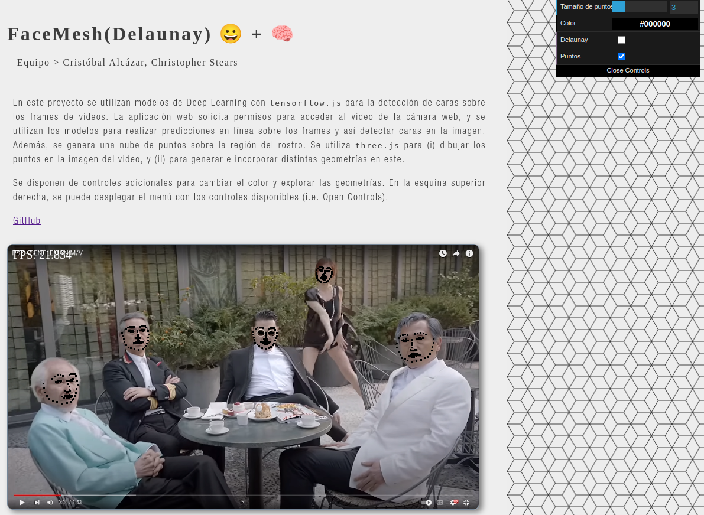
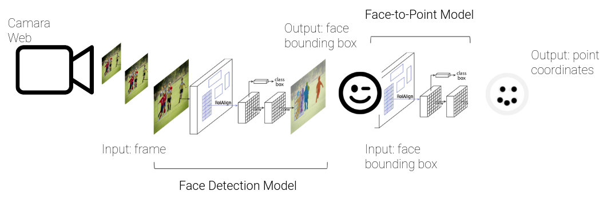

# FaceMesh(Delaunay)



## Descripción

Utilizar modelos de Deep Learning para la detección de caras sobre los frames de videos. Mediante una aplicación web con capacidad de acceder al video de la cámara web, realizar predicciones en línea sobre los frames para detectar caras, y generar una nube de puntos sobre la región de la cara. 

La nube de puntos se utiliza para (i) dibujar los puntos en la imagen del video, y (ii) para generar e incorporar distintas geometrías al video. Se agregan controles adicionales para cambiar color y explorar las geometrías.


A continuación se muestra un diagrama con el pipeline de la aplicación para detectar y generar la nube de puntos sobre la cara.



La salida de la red tiene el siguiente formato:

```
{
    "imageHeight": 134,
    "imageWidth": 87,
    "positions": [
        {
            "_x": 332.833198569715,
            "_y": 208.07798411437142
        },
        {
            "_x": 335.4965223968029,
            "_y": 235.8213532764541
        },
        ...
    ],
}
```

## Citar

Este proyecto fue parte del curso CC7515-1 Computación en GPU, dictado en Otoño 2023.
```
@misc{CC7515-1-Proyecto-Final,
  authors = {Alcázar, Cristóbal}, {Stears, Christopher}
  title = {FaceMesh(Delaunay)},
  year = {2023},
  publisher = {GitHub},
  journal = {GitHub repository},
  howpublished = {\url{https://github.com/CHSTR/proyecto_gpu}},
}
```